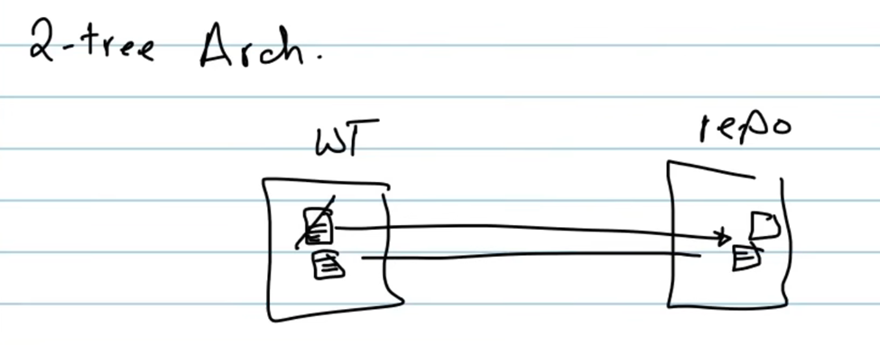
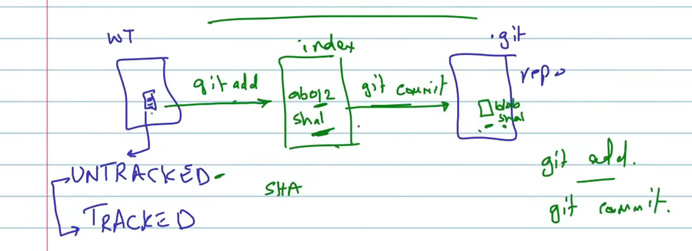
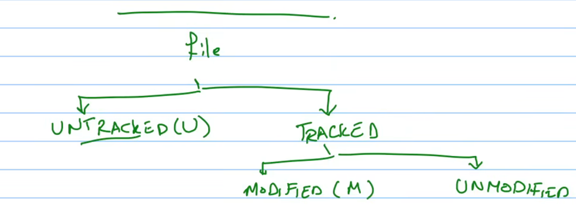

# git-sami

### git requirments

- Track everything
- Os independent
- Uniuq id  
- No content change  

### git objects

- blob => file
- tree => dir
- commit => snapshot

### two tier arch


### three tier arch



### example for creating a file



### untracked then tracked



## install
>
> apt install git

### Identity
>
> git config --global user.name "John Doe"
> git config --global user.email <johndoe@example.com>

### Configurations
>
> git config --list

> git config --global # User (global) -> ~/.gitconfig

> git config --system # System -> /etc/gitconfig

> git config  # Project -> /.git/conifg

### Text Editor
>
> git config --global core.editor vi [or code 🙂]

### Color Output
>
> git config --global color.ui true

# LAB01

```bash
mkdir gitwork
cd gitwork
ls
echo "Hello, Git" >> file.txt
cat file.txt
ls al
ls -al
git init
ls -al
cd .git
ls .git
ls
ls -al
ls -al objects
git status
cd ..
git status

root@Haytham:/mnt/d/HandsOn/git-sami/gitwork# git add *
root@Haytham:/mnt/d/HandsOn/git-sami/gitwork# git status
On branch master

No commits yet

Changes to be committed:
  (use "git rm --cached <file>..." to unstage)
        new file:   file.txt

cd .git/
cd objects/b7/
root@Haytham:/mnt/d/HandsOn/git-sami/gitwork/.git/objects/b7# git cat-file -t b7aec520dec0a7516c18eb4c68b64ae1eb9b5a5e
blob

root@Haytham:/mnt/d/HandsOn/git-sami/gitwork/.git/objects/b7# git cat-file -s b7aec520dec0a7516c18eb4c68b64ae1eb9b5a5e
11

root@Haytham:/mnt/d/HandsOn/git-sami/gitwork/.git/objects/b7# git cat-file -p b7aec520dec0a7516c18eb4c68b64ae1eb9b5a5e
Hello, Git

## to commit 
root@Haytham:/mnt/d/HandsOn/git-sami/gitwork# git commit -m "Initial commit"
[master (root-commit) 4207fd4] Initial commit
 1 file changed, 1 insertion(+)
 create mode 100644 file.txt
root@Haytham:/mnt/d/HandsOn/git-sami/gitwork# git status
On branch master
nothing to commit, working tree clean
root@Haytham:/mnt/d/HandsOn/git-sami/gitwork# 

### you will find three objects
root@Haytham:/mnt/d/HandsOn/git-sami/gitwork# cd .git/objects/
root@Haytham:/mnt/d/HandsOn/git-sami/gitwork/.git/objects# ls
15  42  b7  info  pack
root@Haytham:/mnt/d/HandsOn/git-sami/gitwork/.git/objects# 
```

### LAB02
```bash
haytham@server:~/git-sami$ vim file.txt
haytham@server:~/git-sami$ cat file.txt 
Hello, Git
haytham@server:~/git-sami$ git status 
On branch main
Your branch is up to date with 'origin/main'.

Untracked files:
  (use "git add <file>..." to include in what will be committed)
        file.txt

nothing added to commit but untracked files present (use "git add" to track)
haytham@server:~/git-sami$ git status -s
?? file.txt
haytham@server:~/git-sami$ git add file.txt 
haytham@server:~/git-sami$ git status -s
A  file.txt
haytham@server:~/git-sami$ git commit -m "Added file.txt"
[main 33ca0b3] Added file.txt
 1 file changed, 1 insertion(+)
 create mode 100644 file.txt
haytham@server:~/git-sami$ git log
commit 33ca0b34963ecd89db14227a477ed93fe2c916f8 (HEAD -> main)
Author: haytham.mo7amed <haytham.mo7amed@gmail.com>
Date:   Tue Jun 16 22:01:12 2026 +0300

    Added file.txt

commit a0147301319dd4751004b5fef3cce6f4cc3a6614 (origin/main, origin/HEAD)
Author: Haytham <haytham.mo7amed@gmail.com>
Date:   Tue Jun 16 21:49:10 2026 +0300

    added  steps

commit 151d67d49f1a31993515286eccbb5f1fdea49860
Author: haythammohamd <71211485+HaythamMohamd@users.noreply.github.com>
Date:   Tue Jun 16 19:18:10 2026 +0300

    Initial commit
haytham@server:~/git-sami$ find .git/objects/ -type f
.git/objects/pack/pack-9ce473bfff77765fd8aa15ecbaec5fba4268875c.pack
.git/objects/pack/pack-9ce473bfff77765fd8aa15ecbaec5fba4268875c.rev
.git/objects/pack/pack-9ce473bfff77765fd8aa15ecbaec5fba4268875c.idx
.git/objects/b7/aec520dec0a7516c18eb4c68b64ae1eb9b5a5e
.git/objects/c7/a67c32b3307681733613dc013f7c532b094886
.git/objects/33/ca0b34963ecd89db14227a477ed93fe2c916f8
haytham@server:~/git-sami$ git cat-file -p b7ae
Hello, Git
haytham@server:~/git-sami$ git cat-file -p c7a6
100644 blob 69b537a942d9aec17971d0ad1c48c54d6f0b7252    README.md
100644 blob b7aec520dec0a7516c18eb4c68b64ae1eb9b5a5e    file.txt
160000 commit 4207fd46da9cee8fd8a31f179e7bb7e926bd2ce1  gitwork
100644 blob 16000abd9a2251fd921aa3917e1a3f1f32886747    image-1.png
100644 blob ad9cafa081f16e1f4f222cbf73b97817b3bc0826    image-2.png
100644 blob 82bc437851ca3e4bb6f8a67073a9a03b90b7f332    image-3.png
100644 blob 16000abd9a2251fd921aa3917e1a3f1f32886747    image.png
```

### git is working as linked list


### LAB03
```bash
haytham@server:~/git-sami$ vim file.txt 
haytham@server:~/git-sami$ git status -s
 M file.txt
haytham@server:~/git-sami$ cat file.txt 
Hello, Git
Second line in file.txt
Third line in file.txt
haytham@server:~/git-sami$ git status -s
 M file.txt
haytham@server:~/git-sami$ 
haytham@server:~/git-sami$ ### to know the diff
haytham@server:~/git-sami$ git diff
diff --git a/file.txt b/file.txt
index b7aec52..8481662 100644
--- a/file.txt
+++ b/file.txt
@@ -1 +1,3 @@
 Hello, Git
+Second line in file.txt
+Third line in file.txt


haytham@server:~/git-sami$ ## if you make git add ., there is no difference
haytham@server:~/git-sami$ git status 
On branch main
Your branch is ahead of 'origin/main' by 1 commit.
  (use "git push" to publish your local commits)

Changes not staged for commit:
  (use "git add <file>..." to update what will be committed)
  (use "git restore <file>..." to discard changes in working directory)
        modified:   file.txt

no changes added to commit (use "git add" and/or "git commit -a")
haytham@server:~/git-sami$ git add .
haytham@server:~/git-sami$ git diff
haytham@server:~/git-sami$

haytham@server:~/git-sami$ ## to get difference between working dir and staging
haytham@server:~/git-sami$ git diff --staged
diff --git a/file.txt b/file.txt
index b7aec52..8481662 100644
--- a/file.txt
+++ b/file.txt
@@ -1 +1,3 @@
 Hello, Git
+Second line in file.txt
+Third line in file.txt
haytham@server:~/git-sami$


haytham@server:~/git-sami$ ## to make the commit open with vim
haytham@server:~/git-sami$ git config --global core.edior vim 
haytham@server:~/git-sami$ git commit
[main f470813] Third line added
 1 file changed, 2 insertions(+)
haytham@server:~/git-sami$ git log 
commit f4708131848cae95c640b9ce73b75676d1598b88 (HEAD -> main)
Author: haytham.mo7amed <haytham.mo7amed@gmail.com>
Date:   Tue Jun 16 22:12:20 2026 +0300

    Third line added

commit 33ca0b34963ecd89db14227a477ed93fe2c916f8
Author: haytham.mo7amed <haytham.mo7amed@gmail.com>
Date:   Tue Jun 16 22:01:12 2026 +0300

    Added file.txt

commit a0147301319dd4751004b5fef3cce6f4cc3a6614 (origin/main, origin/HEAD)
Author: Haytham <haytham.mo7amed@gmail.com>
Date:   Tue Jun 16 21:49:10 2026 +0300

    added  steps

commit 151d67d49f1a31993515286eccbb5f1fdea49860
Author: haythammohamd <71211485+HaythamMohamd@users.noreply.github.com>
Date:   Tue Jun 16 19:18:10 2026 +0300

    Initial commit


haytham@server:~/git-sami$ ## to make the commit open with vim
haytham@server:~/git-sami$ git config --global core.edior vim 
haytham@server:~/git-sami$ git commit
[main f470813] Third line added
 1 file changed, 2 insertions(+)
haytham@server:~/git-sami$ git log 
commit f4708131848cae95c640b9ce73b75676d1598b88 (HEAD -> main)
Author: haytham.mo7amed <haytham.mo7amed@gmail.com>
Date:   Tue Jun 16 22:12:20 2026 +0300

    Third line added

commit 33ca0b34963ecd89db14227a477ed93fe2c916f8
Author: haytham.mo7amed <haytham.mo7amed@gmail.com>
Date:   Tue Jun 16 22:01:12 2026 +0300

    Added file.txt

commit a0147301319dd4751004b5fef3cce6f4cc3a6614 (origin/main, origin/HEAD)
Author: Haytham <haytham.mo7amed@gmail.com>
Date:   Tue Jun 16 21:49:10 2026 +0300

    added  steps

commit 151d67d49f1a31993515286eccbb5f1fdea49860
Author: haythammohamd <71211485+HaythamMohamd@users.noreply.github.com>
Date:   Tue Jun 16 19:18:10 2026 +0300

    Initial commit
haytham@server:~/git-sami$ 
haytham@server:~/git-sami$ ### git log
haytham@server:~/git-sami$ git log
commit f4708131848cae95c640b9ce73b75676d1598b88 (HEAD -> main)
Author: haytham.mo7amed <haytham.mo7amed@gmail.com>
Date:   Tue Jun 16 22:12:20 2026 +0300

    Third line added

commit 33ca0b34963ecd89db14227a477ed93fe2c916f8
Author: haytham.mo7amed <haytham.mo7amed@gmail.com>
Date:   Tue Jun 16 22:01:12 2026 +0300

    Added file.txt

commit a0147301319dd4751004b5fef3cce6f4cc3a6614 (origin/main, origin/HEAD)
Author: Haytham <haytham.mo7amed@gmail.com>
Date:   Tue Jun 16 21:49:10 2026 +0300

    added  steps

commit 151d67d49f1a31993515286eccbb5f1fdea49860
Author: haythammohamd <71211485+HaythamMohamd@users.noreply.github.com>
Date:   Tue Jun 16 19:18:10 2026 +0300

    Initial commit
haytham@server:~/git-sami$ git log --oneline
f470813 (HEAD -> main) Third line added
33ca0b3 Added file.txt
a014730 (origin/main, origin/HEAD) added  steps
151d67d Initial commit
haytham@server:~/git-sami$ git log --oneline file.txt
f470813 (HEAD -> main) Third line added
33ca0b3 Added file.txt
haytham@server:~/git-sami$ git log --oneline -2
f470813 (HEAD -> main) Third line added
33ca0b3 Added file.txt
haytham@server:~/git-sami$ git show f470813
commit f4708131848cae95c640b9ce73b75676d1598b88 (HEAD -> main)
Author: haytham.mo7amed <haytham.mo7amed@gmail.com>
Date:   Tue Jun 16 22:12:20 2026 +0300

    Third line added

diff --git a/file.txt b/file.txt
index b7aec52..8481662 100644
--- a/file.txt
+++ b/file.txt
@@ -1 +1,3 @@
 Hello, Git
+Second line in file.txt
+Third line in file.txt
haytham@server:~/git-sami$ git log --oneline --graph
* f470813 (HEAD -> main) Third line added
* 33ca0b3 Added file.txt
* a014730 (origin/main, origin/HEAD) added  steps
* 151d67d Initial commit
haytham@server:~/git-sami$ git diff 33ca0b3..f470813
diff --git a/file.txt b/file.txt
index b7aec52..8481662 100644
--- a/file.txt
+++ b/file.txt
@@ -1 +1,3 @@
 Hello, Git
+Second line in file.txt
+Third line in file.txt


haytham@server:~/git-sami$ ## if you forget add file or missed up the commit msg
haytham@server:~/git-sami$ git commit --amend
[main 79def9a] Third line added - edited with 'git commit --amend'
 Date: Tue Jun 16 22:12:20 2026 +0300
 1 file changed, 2 insertions(+)
haytham@server:~/git-sami$ git log --oneline 
79def9a (HEAD -> main) Third line added - edited with 'git commit --amend'
33ca0b3 Added file.txt
a014730 (origin/main, origin/HEAD) added  steps
151d67d Initial commit
haytham@server:~/git-sami$ 
```

### restore from working dir
```bash
haytham@server:~/git-sami$ echo "First line in file" >> file.txt 
haytham@server:~/git-sami$ 
haytham@server:~/git-sami$ cat file.txt 
Hello, Git
First line in file
haytham@server:~/git-sami$ 
haytham@server:~/git-sami$ git status 
On branch master
Changes not staged for commit:
  (use "git add <file>..." to update what will be committed)
  (use "git restore <file>..." to discard changes in working directory)
        modified:   file.txt

no changes added to commit (use "git add" and/or "git commit -a")
haytham@server:~/git-sami$ 
haytham@server:~/git-sami$ ## el file dah f el working dir, need to restore it
haytham@server:~/git-sami$ git restore file.txt 
haytham@server:~/git-sami$ git status 
On branch master
nothing to commit, working tree clean
haytham@server:~/git-sami$ 
```

### restore from staging or index to working dir
```bash
haytham@server:~/git-sami$ ## edit the file 
haytham@server:~/git-sami$ vim file.txt 
haytham@server:~/git-sami$ echo "Second line in file" >> file.txt 
haytham@server:~/git-sami$ cat file.txt 
Hello, Git
Second line in file
haytham@server:~/git-sami$ git status 
On branch master
Changes not staged for commit:
  (use "git add <file>..." to update what will be committed)
  (use "git restore <file>..." to discard changes in working directory)
        modified:   file.txt

no changes added to commit (use "git add" and/or "git commit -a")
haytham@server:~/git-sami$ git add .
haytham@server:~/git-sami$ git status 
On branch master
Changes to be committed:
  (use "git restore --staged <file>..." to unstage)
        modified:   file.txt

haytham@server:~/git-sami$ 
haytham@server:~/git-sami$ ### to restore from stage or index 
haytham@server:~/git-sami$ git restore --staged file.txt 
haytham@server:~/git-sami$ git status 
On branch master
Changes not staged for commit:
  (use "git add <file>..." to update what will be committed)
  (use "git restore <file>..." to discard changes in working directory)
        modified:   file.txt

no changes added to commit (use "git add" and/or "git commit -a")

haytham@server:~/git-sami$ git commit -am "Second line added to file.txt"
[master 9deb475] Second line added to file.txt
 1 file changed, 1 insertion(+)
haytham@server:~/git-sami$ git log --oneline 
9deb475 (HEAD -> master) Second line added to file.txt
6a7f896 Initial commit
haytham@server:~/git-sami$ echo "Third line in file" >> file.txt 
haytham@server:~/git-sami$ git commit -am "Third line added to file.txt"
[master df20514] Third line added to file.txt
 1 file changed, 1 insertion(+)
haytham@server:~/git-sami$ git log --oneline 
df20514 (HEAD -> master) Third line added to file.txt
9deb475 Second line added to file.txt
6a7f896 Initial commit


haytham@server:~/git-sami$ git log --oneline 
df20514 (HEAD -> master) Third line added to file.txt
9deb475 Second line added to file.txt
6a7f896 Initial commit
haytham@server:~/git-sami$ 
haytham@server:~/git-sami$ git commit --amend
[master ed6b283] Third line added to file.txt --update
 Date: Tue Jun 16 22:34:26 2026 +0300
 1 file changed, 1 insertion(+)
haytham@server:~/git-sami$ git log --oneline 
ed6b283 (HEAD -> master) Third line added to file.txt --update
9deb475 Second line added to file.txt
6a7f896 Initial commit
haytham@server:~/git-sami$


haytham@server:~/git-sami$ echo "Fourth line in file" >> file.txt 
haytham@server:~/git-sami$ git commit -am "Fourth line added to file.txt"
[master c4f50ba] Fourth line added to file.txt
 1 file changed, 1 insertion(+)
haytham@server:~/git-sami$ git log --oneline 
c4f50ba (HEAD -> master) Fourth line added to file.txt
ed6b283 Third line added to file.txt --update
9deb475 Second line added to file.txt
6a7f896 Initial commit
```

### HEAD pointer


```bash
haytham@server:~/git-sami$ ## el HEAD dah pointer byshawer 3la a5er sha commit 
haytham@server:~/git-sami$ cd .git/
haytham@server:~/git-sami/.git$ ll
total 28
-rw-r--r--.  1 haytham haytham   30 Jun 16 22:36 COMMIT_EDITMSG
-rw-r--r--.  1 haytham haytham   92 Jun 16 22:23 config
-rw-r--r--.  1 haytham haytham   73 Jun 16 22:23 description
-rw-r--r--.  1 haytham haytham   23 Jun 16 22:23 HEAD
drwxr-xr-x.  2 haytham haytham 4096 Jun 16 22:23 hooks
-rw-r--r--.  1 haytham haytham  521 Jun 16 22:36 index
drwxr-xr-x.  2 haytham haytham   21 Jun 16 22:23 info
drwxr-xr-x.  3 haytham haytham   30 Jun 16 22:23 logs
drwxr-xr-x. 22 haytham haytham 4096 Jun 16 22:36 objects
drwxr-xr-x.  4 haytham haytham   31 Jun 16 22:23 refs
haytham@server:~/git-sami/.git$ cat HEAD 
ref: refs/heads/master
haytham@server:~/git-sami/.git$ cd refs/heads/
haytham@server:~/git-sami/.git/refs/heads$ ls
master
haytham@server:~/git-sami/.git/refs/heads$ cat master 
c4f50ba6e08020de8a8ecc094224527b9b2ef9b0
haytham@server:~/git-sami/.git/refs/heads$ git log --oneline 
c4f50ba (HEAD -> master) Fourth line added to file.txt
ed6b283 Third line added to file.txt --update
9deb475 Second line added to file.txt
6a7f896 Initial commit
haytham@server:~/git-sami/.git/refs/heads$ git show c4f50ba
commit c4f50ba6e08020de8a8ecc094224527b9b2ef9b0 (HEAD -> master)
Author: haytham.mo7amed <haytham.mo7amed@gmail.com>
Date:   Tue Jun 16 22:36:24 2026 +0300

    Fourth line added to file.txt

diff --git a/file.txt b/file.txt
index 2bdb204..52e1b49 100644
--- a/file.txt
+++ b/file.txt
@@ -1,3 +1,4 @@
 Hello, Git
 Second line in file
 Third line in file
+Fourth line in file
```

### git reset with HEAD
```bash
haytham@server:~/git-sami$ ### git reset with head
haytham@server:~/git-sami$ git log --oneline 
c4f50ba (HEAD -> master) Fourth line added to file.txt
ed6b283 Third line added to file.txt --update
9deb475 Second line added to file.txt
6a7f896 Initial commit
haytham@server:~/git-sami$ git reset --hard HEAD~1
HEAD is now at ed6b283 Third line added to file.txt --update
haytham@server:~/git-sami$ git log --oneline 
ed6b283 (HEAD -> master) Third line added to file.txt --update
9deb475 Second line added to file.txt
6a7f896 Initial commit
haytham@server:~/git-sami$


haytham@server:~/git-sami$ ### 3shan a3raf el old HEAD kan 3la meen
haytham@server:~/git-sami$ git reflog 
ed6b283 (HEAD -> master) HEAD@{0}: reset: moving to HEAD~1
c4f50ba HEAD@{1}: commit: Fourth line added to file.txt
ed6b283 (HEAD -> master) HEAD@{2}: commit (amend): Third line added to file.txt --update
df20514 HEAD@{3}: commit: Third line added to file.txt
9deb475 HEAD@{4}: commit: Second line added to file.txt
6a7f896 HEAD@{5}: commit (initial): Initial commit
haytham@server:~/git-sami$ git reset --hard HEAD@{1}
HEAD is now at c4f50ba Fourth line added to file.txt
haytham@server:~/git-sami$ git log --oneline 
c4f50ba (HEAD -> master) Fourth line added to file.txt
ed6b283 Third line added to file.txt --update
9deb475 Second line added to file.txt
6a7f896 Initial commit
haytham@server:~/git-sami$ 

```

### tags


```bash
haytham@server:~/git-sami$ ### tags 
haytham@server:~/git-sami$ # 01 lightweight
haytham@server:~/git-sami$ # 02 annotated 
haytham@server:~/git-sami$ 
haytham@server:~/git-sami$ echo "Fifth line in file" >> file.txt 
haytham@server:~/git-sami$ git commit -am "Fifth line added to file.txt"
[master 237e1e4] Fifth line added to file.txt
 1 file changed, 4 insertions(+)
haytham@server:~/git-sami$ git log --oneline 
237e1e4 (HEAD -> master) Fifth line added to file.txt
c4f50ba Fourth line added to file.txt
ed6b283 Third line added to file.txt --update
9deb475 Second line added to file.txt
6a7f896 Initial commit
haytham@server:~/git-sami$ git tag -a v2.0 -m "version 2.0 of the file"
haytham@server:~/git-sami$ git log --oneline 
237e1e4 (HEAD -> master, tag: v2.0) Fifth line added to file.txt
c4f50ba Fourth line added to file.txt
ed6b283 Third line added to file.txt --update
9deb475 Second line added to file.txt
6a7f896 Initial commit
haytham@server:~/git-sami$ git tag 
v2.0
haytham@server:~/git-sami$ git show v2.0 
tag v2.0
Tagger: haytham.mo7amed <haytham.mo7amed@gmail.com>
Date:   Tue Jun 16 23:05:38 2026 +0300

version 2.0 of the file

commit 237e1e4ba388b5d6d9c83f011822fbff7a202475 (HEAD -> master, tag: v2.0)
Author: haytham.mo7amed <haytham.mo7amed@gmail.com>
Date:   Tue Jun 16 23:04:58 2026 +0300

    Fifth line added to file.txt

diff --git a/file.txt b/file.txt
index 52e1b49..dee2a69 100644
--- a/file.txt
+++ b/file.txt
@@ -1,4 +1,8 @@
 Hello, Git
+<<<<<<< HEAD
 Second line in file
 Third line in file
 Fourth line in file
+=======
+>>>>>>> parent of 9deb475 (Second line added to file.txt)
+Fifth line in file
haytham@server:~/git-sami$ 
```

### alias graph
```bash
haytham@server:~/git-sami$ alias graph='git log --oneline --decorate --graph --all'
haytham@server:~/git-sami$ graph
* a6f0906 (HEAD -> master) Second line added to file.txt
* 16cd735 Initial commit
haytham@server:~/git-sami$
haytham@server:~/git-sami$ echo "Third line in file" >> file.txt
haytham@server:~/git-sami$ git commit -am "Third line added to file.txt"
[master 2d3d5f8] Third line added to file.txt
 1 file changed, 1 insertion(+)
haytham@server:~/git-sami$ graph
* 2d3d5f8 (HEAD -> master) Third line added to file.txt
* a6f0906 Second line added to file.txt
* 16cd735 Initial commit

```

### Branches


```bash
haytham@server:~/git-sami$ ## to create new branch
haytham@server:~/git-sami$ git branch 
* master
haytham@server:~/git-sami$ git branch testing
haytham@server:~/git-sami$ git branch 
* master
  testing
haytham@server:~/git-sami$ git switch testing 
Switched to branch 'testing'
haytham@server:~/git-sami$ git branch 
  master
* testing
haytham@server:~/git-sami$

## hena el head bases 3la el branch , ay t3deel hykon 3la el test branch 
haytham@server:~/git-sami$ graph
* 2d3d5f8 (HEAD -> testing, master) Third line added to file.txt
* a6f0906 Second line added to file.txt
* 16cd735 Initial commit

haytham@server:~/git-sami$ echo "Fourth line in file" >> file.txt
haytham@server:~/git-sami$ git commit -am "Fourth line added to file.txt"
[testing ef7c59c] Fourth line added to file.txt
 1 file changed, 1 insertion(+)
haytham@server:~/git-sami$ graph
* ef7c59c (HEAD -> testing) Fourth line added to file.txt
* 2d3d5f8 (master) Third line added to file.txt
* a6f0906 Second line added to file.txt
* 16cd735 Initial commit
haytham@server:~/git-sami$

# hena el head 3la el branch
haytham@server:~/git-sami$ git show head
fatal: ambiguous argument 'head': unknown revision or path not in the working tree.
Use '--' to separate paths from revisions, like this:
'git <command> [<revision>...] -- [<file>...]'
haytham@server:~/git-sami$ git show HEAD
commit ef7c59cc334a3ea6f5550c71f542a98435e3331e (HEAD -> testing)
Author: haytham.mo7amed <haytham.mo7amed@gmail.com>
Date:   Tue Jun 16 23:18:43 2026 +0300

    Fourth line added to file.txt

diff --git a/file.txt b/file.txt
index a99ffdf..fae3f86 100644
--- a/file.txt
+++ b/file.txt
@@ -1,3 +1,4 @@
 Hello, Git 
 Second line in file
 Third line in file
+Fourth line in file

## hens swith to master
haytham@server:~/git-sami$ git switch master 
Switched to branch 'master'
haytham@server:~/git-sami$ git show HEAD
commit 2d3d5f85d932b0069c8625c0659f7f353ebe1ef9 (HEAD -> master)
Author: haytham.mo7amed <haytham.mo7amed@gmail.com>
Date:   Tue Jun 16 23:14:41 2026 +0300

    Third line added to file.txt

diff --git a/file.txt b/file.txt
index 1abe02c..a99ffdf 100644
--- a/file.txt
+++ b/file.txt
@@ -1,2 +1,3 @@
 Hello, Git 
 Second line in file
+Third line in file

haytham@server:~/git-sami$ git switch testing 
Switched to branch 'testing'
haytham@server:~/git-sami$ 
haytham@server:~/git-sami$ graph
* ef7c59c (HEAD -> testing) Fourth line added to file.txt
* 2d3d5f8 (master) Third line added to file.txt
* a6f0906 Second line added to file.txt
* 16cd735 Initial commit
haytham@server:~/git-sami$ 
haytham@server:~/git-sami$ 
haytham@server:~/git-sami$ ### to merge ==> got to master ==> then merge testing branch 
haytham@server:~/git-sami$ git switch master 
Switched to branch 'master'
haytham@server:~/git-sami$ git merge testing 
Updating 2d3d5f8..ef7c59c
Fast-forward
 file.txt | 1 +
 1 file changed, 1 insertion(+)
haytham@server:~/git-sami$ graph
* ef7c59c (HEAD -> master, testing) Fourth line added to file.txt
* 2d3d5f8 Third line added to file.txt
* a6f0906 Second line added to file.txt
* 16cd735 Initial commit
haytham@server:~/git-sami$ 


haytham@server:~/git-sami$ ## to delete branch
haytham@server:~/git-sami$ git branch -d testing
Deleted branch testing (was ef7c59c).
haytham@server:~/git-sami$ git branch 
* master
haytham@server:~/git-sami$

##### another scenario
# edit file1 on testing branch
# add new file on master branch
# merge

haytham@server:~/git-sami$ git branch testing
haytham@server:~/git-sami$ git switch testing 
Switched to branch 'testing'
haytham@server:~/git-sami$ graph
* ef7c59c (HEAD -> testing, master) Fourth line added to file.txt
* 2d3d5f8 Third line added to file.txt
* a6f0906 Second line added to file.txt
* 16cd735 Initial commit
haytham@server:~/git-sami$ echo "Fifth line in file" >> file.txt
haytham@server:~/git-sami$ git commit -am "Fifth line added to file.txt"
[testing 946667b] Fifth line added to file.txt
 1 file changed, 1 insertion(+)
haytham@server:~/git-sami$ graph
* 946667b (HEAD -> testing) Fifth line added to file.txt
* ef7c59c (master) Fourth line added to file.txt
* 2d3d5f8 Third line added to file.txt
* a6f0906 Second line added to file.txt
* 16cd735 Initial commit
haytham@server:~/git-sami$ git switch master
Switched to branch 'master'
haytham@server:~/git-sami$ echo "Line one in new file" >> file2.txt
haytham@server:~/git-sami$ git add .
haytham@server:~/git-sami$ git commit -am "New file added in master branch"
[master 05fd141] New file added in master branch
 1 file changed, 1 insertion(+)
 create mode 100644 file2.txt
haytham@server:~/git-sami$ graph
* 05fd141 (HEAD -> master) New file added in master branch
| * 946667b (testing) Fifth line added to file.txt
|/  
* ef7c59c Fourth line added to file.txt
* 2d3d5f8 Third line added to file.txt
* a6f0906 Second line added to file.txt
* 16cd735 Initial commit
haytham@server:~/git-sami$ git switch master 
Already on 'master'
haytham@server:~/git-sami$ git merge testing 
Merge made by the 'ort' strategy.
 file.txt | 1 +
 1 file changed, 1 insertion(+)
haytham@server:~/git-sami$ graph 
*   db28c78 (HEAD -> master) Merge branch 'testing'
|\  
| * 946667b (testing) Fifth line added to file.txt
* | 05fd141 New file added in master branch
|/  
* ef7c59c Fourth line added to file.txt
* 2d3d5f8 Third line added to file.txt
* a6f0906 Second line added to file.txt
* 16cd735 Initial commit

haytham@server:~/git-sami$ git branch -d testing 
Deleted branch testing (was 946667b).
haytham@server:~/git-sami$ git branch 
* master

```

### Merge Conflicts
If you try to do merge commit with conflicting files in both branches git will notify you and abort the process To check the conflicting portions of the file use git status then resolve the conflict then commit then merge again
```bash
git branch -v # to list all branches along with the last commit per each branch. * character indicates the current HEAD pointer
!git branch --merged # to view branches already merged with the current branch
!git branch --no-merged # list all branches that aren't merged with the current
!git branch -d testing # will attempt to delete the testing branch but will fail if it has unmerged work
!git branch -D testing # will forcibly delete the testing branch even if it has unmerged work
!git branch --move bad-branch-name corrected-branch-name # rename a branch. CAREFUL not to rename a branch currently shared
!git branch --move master main # you can also rename the master branch as it is exactly similar to any other branch
```


### Working with remote
the clone is a copy from the repo


```bash
haytham@Haythams-MacBook-Pro git-sami % mkdir remote-repo
haytham@Haythams-MacBook-Pro git-sami % cd remote-repo 
haytham@Haythams-MacBook-Pro remote-repo % echo "first line in file1.txt" >> file1.txt
haytham@Haythams-MacBook-Pro remote-repo % git init 
hint: Using 'master' as the name for the initial branch. This default branch name
hint: will change to "main" in Git 3.0. To configure the initial branch name
hint: to use in all of your new repositories, which will suppress this warning,
hint: call:
hint:
hint:   git config --global init.defaultBranch <name>
hint:
hint: Names commonly chosen instead of 'master' are 'main', 'trunk' and
hint: 'development'. The just-created branch can be renamed via this command:
hint:
hint:   git branch -m <name>
hint:
hint: Disable this message with "git config set advice.defaultBranchName false"
Initialized empty Git repository in /Users/haytham/myData/git-sami/remote-repo/.git/
haytham@Haythams-MacBook-Pro remote-repo % git add .
haytham@Haythams-MacBook-Pro remote-repo % git commit -am "Intial commit"
[master (root-commit) 95196ef] Intial commit
 Committer: Haytham Awadallah <haytham@Haythams-MacBook-Pro.local>
Your name and email address were configured automatically based
on your username and hostname. Please check that they are accurate.
You can suppress this message by setting them explicitly. Run the
following command and follow the instructions in your editor to edit
your configuration file:

    git config --global --edit

After doing this, you may fix the identity used for this commit with:

    git commit --amend --reset-author

 1 file changed, 1 insertion(+)
 create mode 100644 file1.txt
haytham@Haythams-MacBook-Pro remote-repo % pwd
/Users/haytham/myData/git-sami/remote-repo
haytham@Haythams-MacBook-Pro remote-repo % cd ..
haytham@Haythams-MacBook-Pro git-sami % cd ..
haytham@Haythams-MacBook-Pro myData % mkdir local-repo
haytham@Haythams-MacBook-Pro myData % cd local-repo 
haytham@Haythams-MacBook-Pro local-repo % 
haytham@Haythams-MacBook-Pro local-repo % git clone /Users/haytham/myData/git-sami/remote-repo
Cloning into 'remote-repo'...
done.
haytham@Haythams-MacBook-Pro local-repo % ls
remote-repo
haytham@Haythams-MacBook-Pro local-repo % cd lo
cd: no such file or directory: lo
haytham@Haythams-MacBook-Pro local-repo % ls
remote-repo
haytham@Haythams-MacBook-Pro local-repo % git remote
fatal: not a git repository (or any of the parent directories): .git
haytham@Haythams-MacBook-Pro local-repo % git remote -v
fatal: not a git repository (or any of the parent directories): .git
haytham@Haythams-MacBook-Pro local-repo % cd remote-repo 
haytham@Haythams-MacBook-Pro remote-repo % git remote -v 
origin  /Users/haytham/myData/git-sami/remote-repo (fetch)
origin  /Users/haytham/myData/git-sami/remote-repo (push)
haytham@Haythams-MacBook-Pro remote-repo % git log --oneline
95196ef (HEAD -> master, origin/master, origin/HEAD) Intial commit
haytham@Haythams-MacBook-Pro remote-repo % echo "Second line in file1.txt at remote" >> /Users/haytham/myData/git-sami/remote-repo/file1.txt
haytham@Haythams-MacBook-Pro remote-repo % cd /Users/haytham/myData/git-sami/remote-repo/         
haytham@Haythams-MacBook-Pro remote-repo % git commit -am "Second commit in remote" 
[master 77f92d3] Second commit in remote
 Committer: Haytham Awadallah <haytham@Haythams-MacBook-Pro.local>
Your name and email address were configured automatically based
on your username and hostname. Please check that they are accurate.
You can suppress this message by setting them explicitly. Run the
following command and follow the instructions in your editor to edit
your configuration file:

    git config --global --edit

After doing this, you may fix the identity used for this commit with:

    git commit --amend --reset-author

 1 file changed, 1 insertion(+)
haytham@Haythams-MacBook-Pro remote-repo % cd ../../local-repo 
haytham@Haythams-MacBook-Pro local-repo % cd remote-repo 
haytham@Haythams-MacBook-Pro remote-repo % git brach
git: 'brach' is not a git command. See 'git --help'.

The most similar command is
        branch
haytham@Haythams-MacBook-Pro remote-repo % git branch
* master
haytham@Haythams-MacBook-Pro remote-repo % git branch -r
  origin/HEAD -> origin/master
  origin/master
haytham@Haythams-MacBook-Pro remote-repo % git fetch origin 
remote: Enumerating objects: 5, done.
remote: Counting objects: 100% (5/5), done.
remote: Compressing objects: 100% (2/2), done.
remote: Total 3 (delta 0), reused 0 (delta 0), pack-reused 0 (from 0)
Unpacking objects: 100% (3/3), 289 bytes | 289.00 KiB/s, done.
From /Users/haytham/myData/git-sami/remote-repo
   95196ef..77f92d3  master     -> origin/master
haytham@Haythams-MacBook-Pro remote-repo % cat file1.txt 
first line in file1.txt
haytham@Haythams-MacBook-Pro remote-repo % git log --oneline
95196ef (HEAD -> master) Intial commit
haytham@Haythams-MacBook-Pro remote-repo % git pull origin  
Updating 95196ef..77f92d3
Fast-forward
 file1.txt | 1 +
 1 file changed, 1 insertion(+)
haytham@Haythams-MacBook-Pro remote-repo % cat file1.txt    
first line in file1.txt
Second line in file1.txt at remote
haytham@Haythams-MacBook-Pro remote-repo % git log --oneline
77f92d3 (HEAD -> master, origin/master, origin/HEAD) Second commit in remote
95196ef Intial commit
haytham@Haythams-MacBook-Pro remote-repo % git cat-file -p 77f92d3
tree 3922fa64df8857347889d5fcdc5c7da6013fb49a
parent 95196efafbab6fc88f22196182c9144e5011db4a
author Haytham Awadallah <haytham@Haythams-MacBook-Pro.local> 1781780558 +0300
committer Haytham Awadallah <haytham@Haythams-MacBook-Pro.local> 1781780558 +0300

Second commit in remote

```

### git in vscode
- gitlens
- git graph


### github 

### gitea
